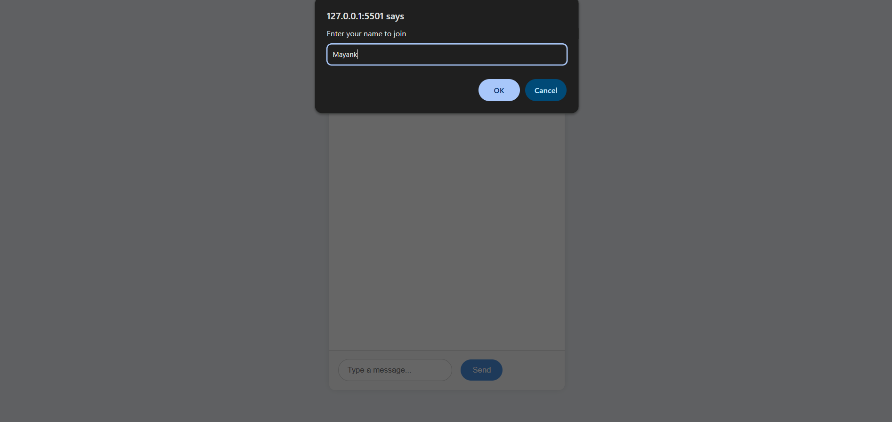
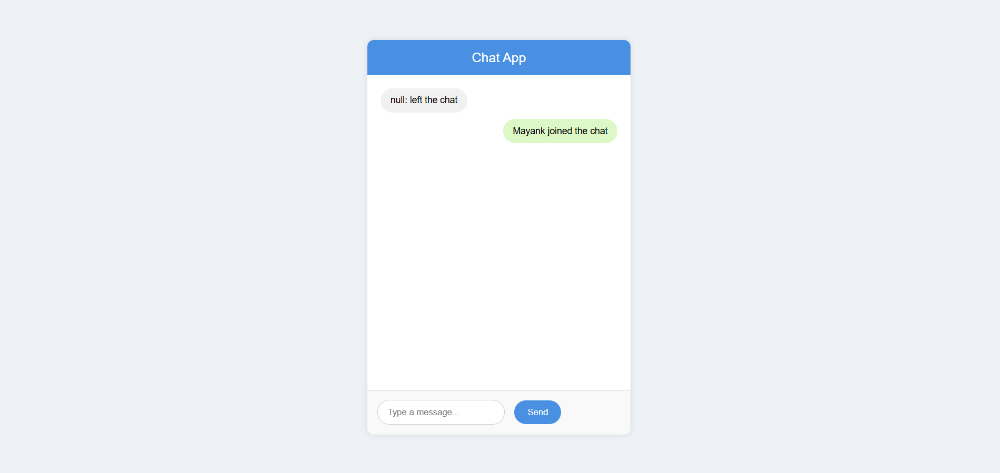
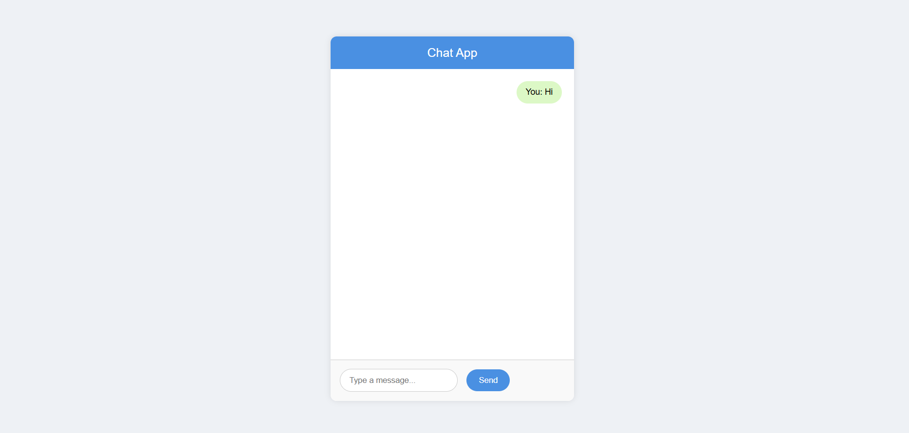
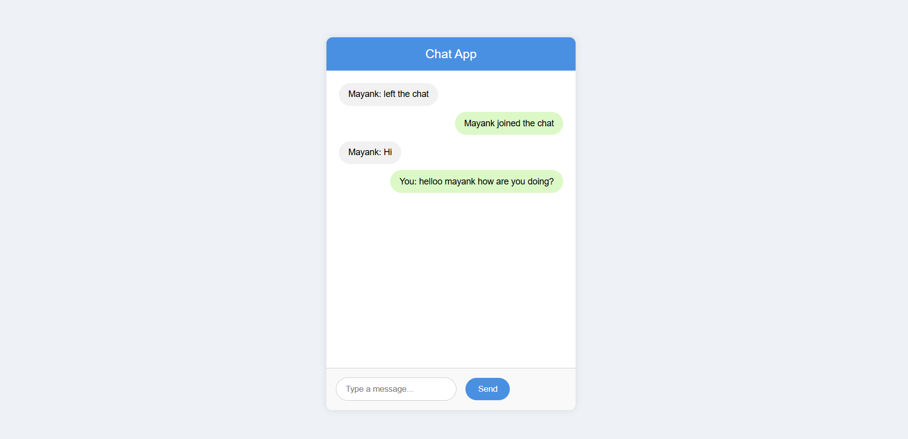
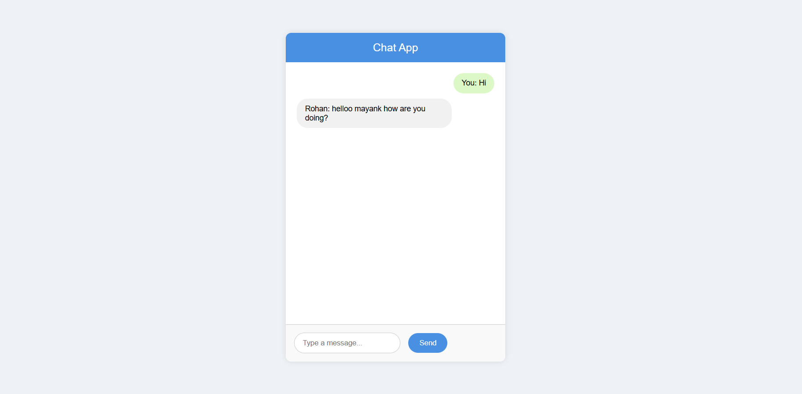

#  Real-Time Chat Application using Node.js and Socket.IO

This is a real-time chat application built with **Node.js**, **Express.js**, and **Socket.IO**. It allows multiple users to chat instantly in a shared room using WebSockets.

# Features

- Real-time bi-directional communication
- Join/leave chat notifications
- Chat message broadcasting to all connected users
- Simple and clean UI

  🖼️ Screenshots
Here are some snapshots of the application in action:

👥 Before the Chat Room Interface your username is being asked

📱 Real-Time Messaging

🧑‍🤝‍🧑 Join Notification

💬 Multiple Users Chatting

🎉 Clean UI and Exit Handling

